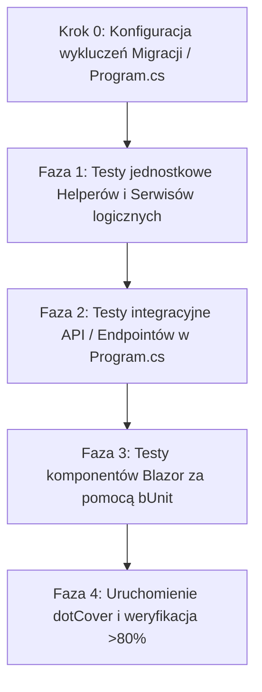

# Plan Osiągnięcia >80% Coverage dla Projektu Jira

Niniejszy dokument przedstawia strategię i plan działania mający na celu osiągnięcie co najmniej **80% pokrycia testami (Test Coverage)** w projekcie `jira` (.NET 10.0 z komponentami Blazor Server), bazując na analizie raportu dotCover (`Untitled.html`).

---

## 1. Analiza stanu obecnego (na podstawie raportu)

Z raportu `Untitled.html` wynika, że aktualny wskaźnik pokrycia kodu dla projektu `jira` wynosi **0%** (ogólnie 1% ze względu na puste klasy testowe w `jira.Tests`). 
Mimo obecności 25 testów w katalogu `jira.Tests/E2E`, pokrycie głównych komponentów aplikacji nie zostało zarejestrowane. Wynika to z faktu, że:
- Istniejące testy bazy danych testują głównie same modele bazodanowe EF Core w pamięci, ale nie wywołują logiki biznesowej, helperów ani komponentów UI.
- Kod wygenerowany automatycznie (np. migracje w `jira/Migrations/`) drastycznie zaniża statystyki, ponieważ zawiera setki linii kodu schematu bazodanowego, który nie powinien być testowany.

---

## 2. Krok 0: Konfiguracja i Wykluczenia (Exclusions)
Aby osiągnąć **rzeczywiste i miarodajne** 80% pokrycia kodu, z kalkulacji pokrycia należy bezwzględnie wykluczyć pliki, które nie zawierają logiki biznesowej.

### Co wykluczamy:
1. **Migracje EF Core** (`jira.Migrations.*`): Pliki automatycznie generowane przez Entity Framework.
2. **Pliki startowe i konfiguracyjne** (`Program.cs` / startup): Trudne do przetestowania jednostkowego, zawierają głównie rejestrację kontenera DI.
3. **DbContextFactory** (`AppDbContextFactory.cs`): Używany tylko w czasie projektowania (design-time) do migracji.

### Jak to skonfigurować:
Do uruchamiania testów z narzędziem Coverlet (wbudowanym w `jira.Tests.csproj`) używamy poniższych filtrów wykluczających:
```bash
dotnet test /p:CollectCoverage=true /p:CoverletOutputFormat=cobertura /p:Exclude="[jira]jira.Migrations.*,%2c[jira]Program%2c[jira]jira.Data.AppDbContextFactory"
```
Dodatkowo klasy migracji lub wybrane helpery można oznaczyć atrybutem `[ExcludeFromCodeCoverage]` z przestrzeni `System.Diagnostics.CodeAnalysis`.

---

## 3. Plan Działania (Krok po Kroku)



### Faza 1: Testy Jednostkowe (Unit Tests) — Najszybszy przyrost coverage
Testujemy klasy posiadające czystą logikę biznesową, bez skomplikowanych zależności:
- **`OAuthHelper.cs`**: Metoda `BuildPrincipal(Uzytkownik)` – bardzo prosta do przetestowania (przekazanie użytkownika i asercja poprawności claims).
- **`ConnectionStringHelper.cs`**: Budowanie connection stringa na podstawie zmiennych środowiskowych.
- **`BoardStateService.cs`**: Serwis zdarzeń Blazora – subskrypcja zdarzenia `OnBoardCreated` i wywołanie `NotifyBoardCreatedAsync()`.
- **`SendGridEmailService.cs`**: Testy sprawdzające budowanie wiadomości e-mail oraz obsługę sytuacji, gdy klucze API nie są skonfigurowane (za pomocą mockowania `ILogger`).

### Faza 2: Testy Integracyjne (Integration Tests)
Testujemy integrację z bazą danych oraz endpointy autoryzacyjne w `Program.cs` (MapGet / MapPost):
- Użycie `Microsoft.AspNetCore.Mvc.Testing` i klasy `WebApplicationFactory` do wzniesienia testowego serwera HTTP w pamięci.
- Testowanie endpointów: `/api/auth/login`, `/api/auth/logout`, oraz `/api/auth/callback` z podstawieniem mocka dla `HttpContext.AuthenticateAsync()`.

### Faza 3: Testy Komponentów UI (bUnit Tests)
Ponieważ spora część kodu aplikacji znajduje się w plikach `.razor` (Blazor Components), ich przetestowanie za pomocą bUnit jest kluczowe:
- **Komponenty prezentacyjne**: `TicketCard.razor`, `StatusColumn.razor`, `NavMenu.razor` (testowanie renderowania danych wejściowych, kolorów avatarów itp.).
- **Interaktywne formularze**: `ProjectCreate.razor`, `TicketCreate.razor` (symulacja wpisania tekstu i kliknięcia "Utwórz", weryfikacja czy wywołały się metody bazodanowe/serwisowe).
- **Główna tablica**: `Board.razor` (testowanie operacji drag & drop, otwierania modali, dodawania komentarzy).

---

## 4. Podział na Foldery w `jira.Tests`

Zalecana struktura katalogów w projekcie testowym w celu utrzymania porządku:

```text
jira.Tests/
│
├── Fixtures/                       # Klasy pomocnicze i konfiguracja baz danych (InMemory)
│   ├── TestDatabaseFixture.cs      # Inicjalizacja AppDbContext z InMemoryDatabase
│   ├── TestDataBuilder.cs          # Builder obiektów testowych (User, Board, Task)
│   └── BlazorTestContext.cs        # (Opcjonalnie) Wspólna klasa bazowa dla testów bUnit
│
├── Unit/                           # Czyste testy jednostkowe (bez bazy danych i UI)
│   ├── Services/
│   │   ├── BoardStateServiceTests.cs
│   │   └── SendGridEmailServiceTests.cs
│   └── Helpers/
│       ├── OAuthHelperTests.cs
│       └── ConnectionStringHelperTests.cs
│
├── Integration/                    # Testy integracyjne z bazą i endpointami API
│   ├── Data/
│   │   └── AppDbContextTests.cs    # Testy relacji i zapytań LINQ
│   └── Controllers/
│       └── AuthEndpointsTests.cs   # Testy endpointów /api/auth/*
│
└── Components/                     # Testy bUnit dla komponentów Blazor (.razor)
    ├── UI/
    │   ├── TicketCardTests.cs
    │   └── StatusColumnTests.cs
    ├── Layout/
    │   └── NavMenuTests.cs
    └── Pages/
        ├── BoardTests.cs
        ├── LoginTests.cs
        └── ProjectCreateTests.cs
```

---

## 5. Scenariusze Testowe (Test Scenarios)

### Serwisy i Helpery (Unit)
1. **`OAuthHelper.BuildPrincipal`**:
   - *Scenariusz*: Przekazanie użytkownika o poprawnych danych (np. email, nazwa użytkownika, Id).
   - *Asercja*: Zweryfikowanie czy claims (`NameIdentifier`, `Email`, `Name`) mają poprawne wartości i schemat uwierzytelniania to "oauth".
2. **`ConnectionStringHelper.Build`**:
   - *Scenariusz*: Brak zmiennych środowiskowych w systemie.
   - *Asercja*: Powinno rzucić odpowiedni wyjątek lub zwrócić domyślny format.
   - *Scenariusz*: Ustawienie zmiennych `DATABASE_URL` lub `DB_HOST`, `DB_USER` itd.
   - *Asercja*: Zwrócony connection string jest poprawnie sformatowany pod Npgsql.
3. **`BoardStateService.NotifyBoardCreatedAsync`**:
   - *Scenariusz*: Wywołanie powiadomienia, gdy brak zarejestrowanych subskrybentów.
   - *Asercja*: Metoda kończy się bez błędu.
   - *Scenariusz*: Zarejestrowanie dwóch subskrybentów (metod asynchronicznych) i wywołanie metody.
   - *Asercja*: Obaj subskrybenci zostali uruchomieni i wykonali swoje zadanie.

### Komponenty Blazor (bUnit)
1. **`TicketCard.razor`**:
   - *Scenariusz*: Wyrenderowanie zadania z priorytetem "wysoki".
   - *Asercja*: Sprawdzenie, czy karta posiada odpowiednią klasę CSS (np. border-red / bg-red) i wyświetla poprawny tytuł oraz skrót ID.
2. **`StatusColumn.razor`**:
   - *Scenariusz*: Wyrenderowanie kolumny z listą 3 zadań.
   - *Asercja*: Sprawdzenie, czy wyrenderowały się dokładnie 3 tagi `<div class="ticket-card">` (lub odpowiedniki komponentu `TicketCard`).
3. **`ProjectCreate.razor`**:
   - *Scenariusz*: Użytkownik wypełnia pole "Nazwa tablicy" i klika przycisk "Zapisz".
   - *Asercja*: Sprawdzenie, czy baza danych wzbogaciła się o nowy rekord oraz czy serwis `BoardStateService` wysłał powiadomienie o utworzeniu tablicy.

---

## 6. Prompty do Generowania Testów

Poniższe szablony promptów (do użycia w sesji z LLM) pozwolą na błyskawiczne wygenerowanie kompletnych plików testowych dopasowanych do struktury projektu.

### Prompt 1: Generowanie testów dla Serwisów / Helperów (xUnit)
```text
Jesteś ekspertem testów w .NET 10.0 i xUnit. 
Napisz testy jednostkowe dla poniższej klasy, korzystając z biblioteki xUnit. 
Użyj czystych mocków (np. za pomocą NSubstitute/Moq) jeśli klasa posiada zależności.
Upewnij się, że pokrywasz 100% gałęzi (branch coverage) danej klasy, w tym przypadki brzegowe i wyjątki.

[WKLEJ TUTAJ ZAWARTOŚĆ PLIKU, NP. OAuthHelper.cs lub BoardStateService.cs]
```

### Prompt 2: Generowanie testów komponentu Blazor (bUnit)
```text
Jesteś ekspertem od testowania komponentów Blazor przy użyciu biblioteki bUnit i xUnit w .NET 10.0.
Stwórz plik testowy dla poniższego komponentu Razor. 
W testach bUnit:
- Skonfiguruj niezbędne usługi (Services.AddScoped, AddSingleton) w testowym konenerze DI.
- Użyj InMemoryDatabase dla AppDbContext, jeśli komponent bezpośrednio komunikuje się z bazą danych (lub zmockuj AppDbContext).
- Wyrenderuj komponent za pomocą RenderComponent<T>().
- Przetestuj zachowania UI: interakcje (kliknięcia przycisków, drag & drop), wprowadzanie danych do formularzy (form submission), poprawność renderowania warunkowego.
- Zaimplementuj asercje badające strukturę DOM wyjściowego HTML komponentu.

[WKLEJ TUTAJ KOD KOMPONENTU .razor ORAZ JEGO ewentualny plik code-behind .razor.cs]
```

### Prompt 3: Generowanie testów integracyjnych API z Mockiem Autentykacji
```text
Napisz test integracyjny przy użyciu Microsoft.AspNetCore.Mvc.Testing (WebApplicationFactory) dla endpointu autoryzacji w pliku Program.cs w aplikacji ASP.NET Core 10.0.
Celem jest przetestowanie endpointu '/api/auth/callback'.
Wymagania:
- Zbuduj niestandardową klasę WebApplicationFactory, która podmienia rzeczywistą bazę PostgreSQL na Entity Framework Core InMemory.
- Zmockuj zachowanie HttpContext.AuthenticateAsync(CookieAuthenticationDefaults.AuthenticationScheme) i zewnętrznego dostawcy OAuth tak, aby zwracały predefiniowane ClaimsPrincipal (np. z adresem e-mail i identyfikatorem).
- Wyślij żądanie GET do '/api/auth/callback?provider=GitHub' i sprawdź, czy użytkownik jest poprawnie dodawany do bazy danych, oraz czy następuje przekierowanie do odpowiedniego adresu.
```
